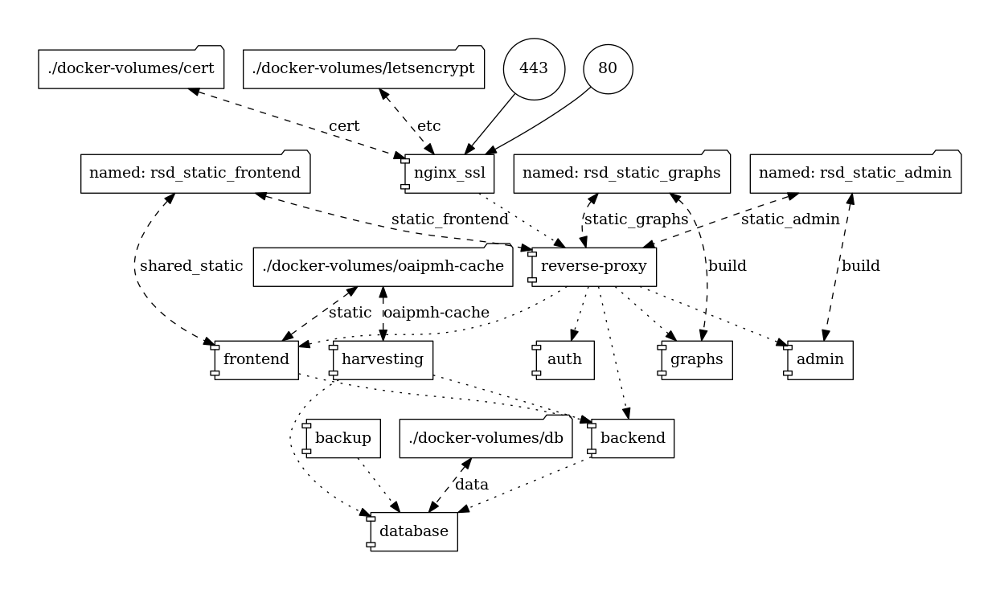

# Documentation for developers

## Try it out, step 1/3: Fork and clone

Click the ``Fork`` button on
[https://github.com/research-software-directory/research-software-directory/](https://github.com/research-software-directory/research-software-directory/)
to fork to your own GitHub organization or GitHub profile, then:

```shell
git clone https://github.com/<your-github-organization>/research-software-directory.git
```

## Try it out, step 2/3: Configure

See section [Using your own data sources](./using-your-own-data-sources.md).

## Try it out, step 3/3: Start the complete stack using [docker-compose](https://docs.docker.com/compose/)

```shell
# build all containers:
docker-compose build

# start the full stack using docker-compose:
docker-compose up -d

# see logging from all services with
docker-compose logs --follow

# or from a specific service only, e.g. backend
docker-compose logs --follow backend
```

After the Research Software Directory instance is up and running, we want to
start harvesting data from external sources such as GitHub, Zotero, Zenodo, etc.
To do so, open a new terminal and run

```shell
docker-compose exec harvesting python app.py harvest all
```

You should see some feedback in the newly opened terminal.

After the ``harvest all`` task finishes, several database collections should
have been updated, but we still need to use the data from those separate
collections and combine them into one document that we can feed to the frontend.
This is done with the ``resolve all`` task, as follows:

```shell
docker-compose exec harvesting python app.py resolve all
```

By default, the ``resolve all`` task runs every 10 minutes anyway, so you could just wait for a bit, until you see some output scroll by that is generated by the ``rsd-harvesting`` container, something like:

```shell
rsd-harvesting     | 2018-07-11 10:30:02,990 cache [INFO] processing software Xenon command line interface
rsd-harvesting     | 2018-07-11 10:30:03,013 cache [INFO] processing software Xenon gRPC server
rsd-harvesting     | 2018-07-11 10:30:03,036 cache [INFO] processing software xtas
rsd-harvesting     | 2018-07-11 10:30:03,059 cache [INFO] processing software boatswain
rsd-harvesting     | 2018-07-11 10:30:03,080 cache [INFO] processing software Research Software Directory
rsd-harvesting     | 2018-07-11 10:30:03,122 cache [INFO] processing software cffconvert
rsd-harvesting     | 2018-07-11 10:30:03,149 cache [INFO] processing software sv-callers
```

## Verifying the local installation

Open a web browser to verify that everything works as it should. Below are some things to check:

### Frontend

- [``http://localhost``](http://localhost) should show the software index page to the local instance of the Research Software Directory
- [``http://localhost/projects``](http://localhost/projects) should show the project index page to the local instance of the Research Software Directory
- [``http://localhost/projects/``](http://localhost/projects/)  should show the project index page to the local instance of the Research Software Directory
- [``http://localhost/projects/764``](http://localhost/projects/764) should show a project page (here: ABC-MUSE) in the local instance of the Research Software Directory
- [``http://localhost/software``](http://localhost/software) should show the software index page to the local instance of the Research Software Directory
- [``http://localhost/software/``](http://localhost/software/) should show the software index page to the local instance of the Research Software Directory
- [``http://localhost/software/xenon``](http://localhost/software/xenon) should show a product page (here: Xenon) in the local instance of the Research Software Directory
- [``http://localhost/graphs``](http://localhost/graphs) should show you some integrated statistics of all the packages in the local instance of the Research Software Directory
- [``http://localhost/about``](http://localhost/about) should show the about page in the local instance of the Research Software Directory

### Admin interface

- [``http://localhost/admin``](http://localhost/admin) should show the Admin interface to the local instance of the Research Software Directory

### API

- [``http://localhost/api/mention``](http://localhost/api/mention) should show a JSON representation of all mentions in the local instance of the Research Software Directory
- [``http://localhost/api/organization``](http://localhost/api/organization) should show a JSON representation of all organizations in the local instance of the Research Software Directory
- [``http://localhost/api/project_cache``](http://localhost/api/project_cache) should show a JSON representation of all projects in the local instance of the Research Software Directory, with all references resolved
- [``http://localhost/api/project``](http://localhost/api/project) should show a JSON representation of all projects in the local instance of the Research Software Directory
- [``http://localhost/api/release``](http://localhost/api/release) should show a JSON representation of all releases in the local instance of the Research Software Directory
- [``http://localhost/api/schema``](http://localhost/api/schema) should show the schema for the local instance of the Research Software Directory
- [``http://localhost/api/software_cache``](http://localhost/api/software_cache) should show a JSON representation of all software in the local instance of the Research Software Directory, with all references resolved
- [``http://localhost/api/software/xenon``](http://localhost/api/software/xenon) should show a JSON representation of a product (here: Xenon) in the local instance of the Research Software Directory
- [``http://localhost/api/software``](http://localhost/api/software) should show a JSON representation of all software in the local instance of the Research Software Directory

The api endpoints also support the following query parameters:

- ``sort`` (e.g. ``sort=updatedAt``)
- ``direction`` (e.g. ``direction=desc``)
- ``limit`` (e.g. ``limit=3``)

Which can be combined in the usual way, e.g.

- [``http://localhost/api/mention?limit=3&direction=desc&sort=updatedAt``](http://localhost/api/mention?limit=3&direction=desc&sort=updatedAt) should return the 3 mentions that were updated most recently.

### Citation

- [``http://localhost/cite/xenon?version=3.0.4&format=bibtex``](http://localhost/cite/xenon?version=3.0.4&format=bibtex) should return a reference manager file for software package Xenon version 3.0.4 in BibTeX format.

### OAI-PMH

- [``http://localhost/oai-pmh?verb=ListRecords&metadataPrefix=datacite4``](http://localhost/oai-pmh?verb=ListRecords&metadataPrefix=datacite4) should return an XML document with metadata about all the packages that are in the local instance of the Research Software Directory, in DataCite 4 format.

### Harvesting schedule

- [``http://localhost/schedule``](http://localhost/schedule) should return the cron job describing when each harvester is scheduled to run.

## Removing local state

The Research Software Directory stores its state in a couple of places. While
doing development, sometimes you need to clear the local state, therefore this
section lists some ways to clear such state. Be aware that running these
commands results in the **LOSS OF DATA**.

- Remove a docker container:

    ```shell
    # remove a container associated with a specific service from docker-compose.yml
    docker-compose rm <service name>

    # remove any container corresponding to any of the services defined in docker-compose.yml
    docker-compose rm
    ```

- Remove a docker image:

    ```shell
    # remove a specific image
    docker rmi <image name>
    ```

- Docker bind mounts store data in ``<project directory>/docker-volumes``, remove with:

    ```shell
    sudo rm -rf docker-volumes/db/ docker-volumes/oaipmh-cache/
    ```

- Docker static volumes store data. Refer to [/docker-compose.yml](/docker-compose.yml) to see which services use which volumes. Remove a volume with:

    ```shell
    # remove volumes that are not in use by any containers
    docker volume prune

    # or remove a specific volume
    docker volume rm <volume>
    ```

- Docker networks. By default, the services in [/docker-compose.yml](/docker-compose.yml) share a network named ``rsd_default``. Remove a network with

    ```shell
    # remove networks that are not in use by any containers
    docker network prune

    # or remove a specific network
    docker network rm <network>
    ```

- To remove Docker container, images, static volumes and networks in single step (bind mounts still need to be removed separately) with

    ```shell
    docker-compose down --rmi all -v
    ```

## Checking if there's any documentation with invalid links

The repository comes with documentation spread out over multiple MarkDown files.
[This workflow file](./../.github/workflows/markdown-link-checker.yml) is set up to check whether there are broken links in
any of them. If you want to check this locally, you can do so with:

```shell
# from the repository root directory
npm install
npm run mlc
```

## Running the superlinter locally

We use GitHub's [Super-Linter](https://github.com/github/super-linter) to lint all directories using a variety of
linters. You can run the superlinter using `docker`, as follows:

```shell
# get the linter
docker pull github/super-linter:latest

# run the linter
docker run \
   -e RUN_LOCAL=true \
   -v ${PWD}:/tmp/lint \
   github/super-linter
```

The superlinter can be a bit slow if you run all checks on all directories, but you can run just one check on one file
with a [specific linter](https://github.com/github/super-linter#environment-variables) if needed, like so:

```shell
# run the linter with only pylint check enabled
docker run \
   -e RUN_LOCAL=true \
   -e VALIDATE_PYTHON_PYLINT=true \
   -v ${PWD}/harvesting/app.py:/tmp/lint/app.py \
   github/super-linter
```

or evaluate a whole subdirectory, all checks:

```shell
cd harvesting
docker run \
   -e RUN_LOCAL=true \
   -v ${PWD}:/tmp/lint \
   github/super-linter
```

or evaluate the same whole subdirectory, but do just one check:

```shell
cd harvesting
docker run \
   -e RUN_LOCAL=true \
   -e VALIDATE_PYTHON_PYLINT=true \
   -v ${PWD}:/tmp/lint \
   github/super-linter
```

By default, the GitHub Super-Linter generates a log file inside the container, which is subsequently mapped to your file
system where it appears as a file named `super-linter.log` with root permissions. You can disable this behavior by
setting the bind mount as read-only (`:ro`), as follows:

```shell
docker run \
   -e RUN_LOCAL=true \
   -v ${PWD}:/tmp/lint:ro \
   github/super-linter
```

### The output on GitHub looks different

The workflow file that we use for our continuous integration on GitHub Actions has a per-directory configuration with a
custom list of linters for each directory (see [/.github/workflows/linting.yml](/.github/workflows/linting.yml)). If you
want your local setup to reflect exactly what runs on GitHub, it may therefore be convenient to use
[`act`](https://github.com/nektos/act).

See also [this
comment](https://github.com/research-software-directory/research-software-directory/pull/624#pullrequestreview-528215446).

## Visualizing ``docker-compose.yml``

It is sometimes helpful to visualize the structure in the ``docker-compose.yml`` file.
Use [https://github.com/pmsipilot/docker-compose-viz](https://github.com/pmsipilot/docker-compose-viz) to generate a png image.

```shell
docker run --rm -it --name dcv -v $(pwd):/input pmsipilot/docker-compose-viz \
   render -m image --output-file=docs/images/docker-compose.png docker-compose.yml
```

For example,


